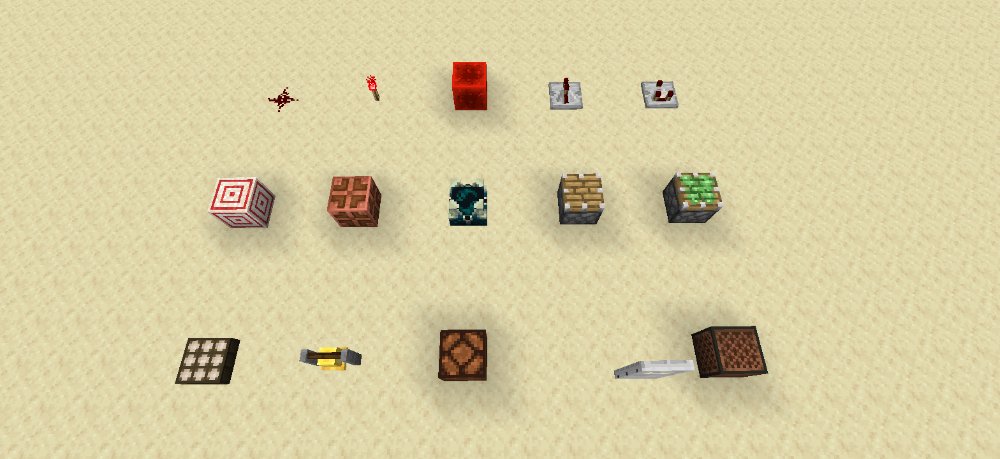
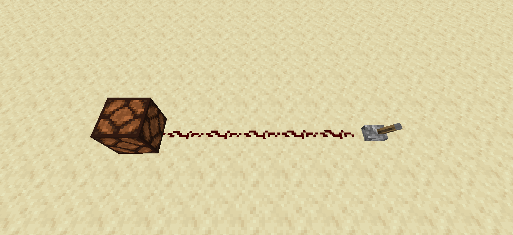
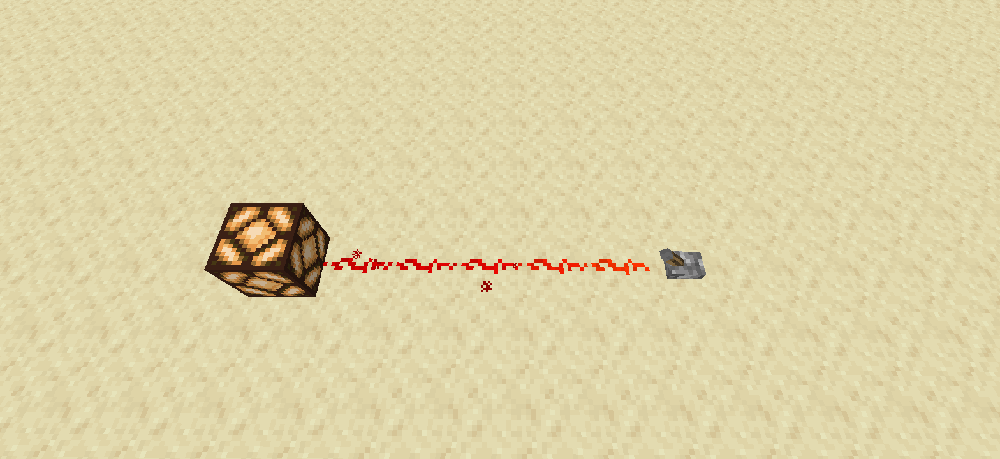
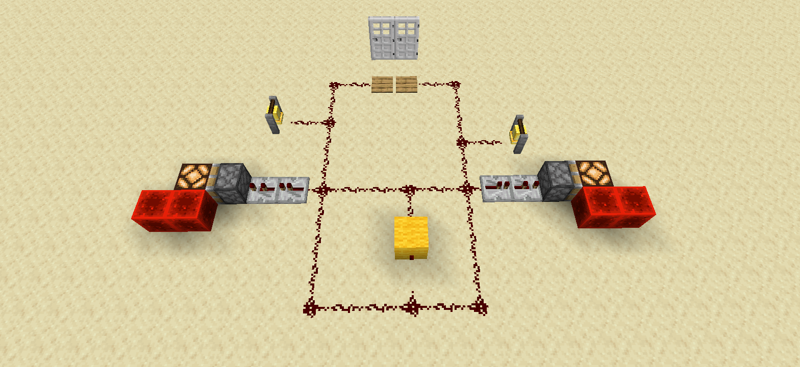
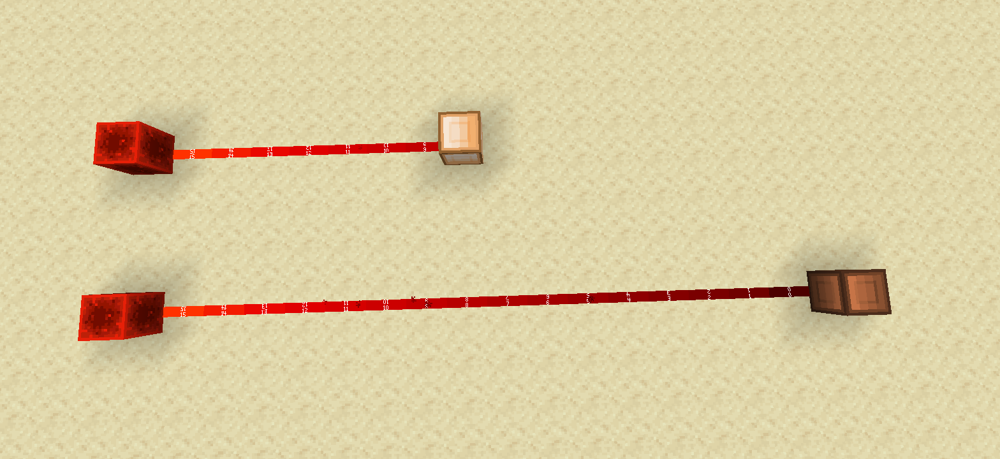
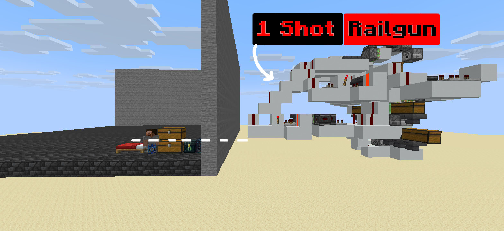
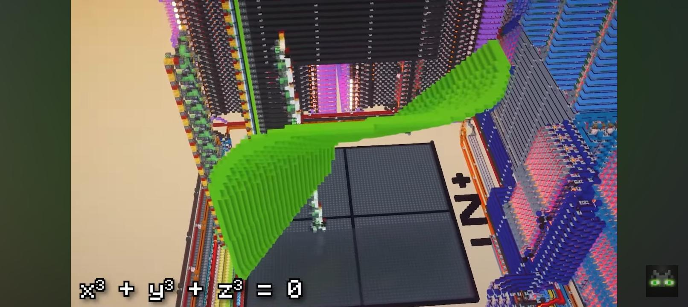
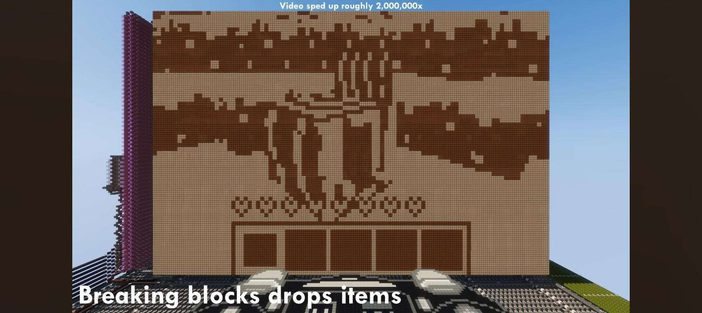

# Why Redstone?

### How a few red dust particles turned Minecraft into an engineering playground

## It starts incredibly simply

If you have played Minecraft for long enough, you have probably seen redstone.

Maybe you have used it to open a door. Maybe you have made an automatic farm. Maybe you saw a massive redstone machine on YouTube and immediately decided that you were never going to understand what was happening.

And maybe you have never touched it at all.

Redstone looks complicated from the outside, but the strange thing about it is that **<mark>you don't need to understand complicated redstone to start enjoying it.</mark>**

You can begin with a lever and a lamp.

And then, somehow, you end up wondering whether you can build a computer inside a block game.

That progression is what makes redstone so interesting.

## It starts with a simple idea

At its most basic, redstone is just a way of making one thing cause another thing to happen.

You press a button. A redstone signal travels through some dust. A lamp turns on.

That's it.

**<mark>It responds to you immediately.</mark>**

You can have an idea, build it, test it, watch it fail spectacularly, change something, and try again.

And that last part is important. Because redstone fails a lot.

And weirdly, that's one of the reasons people like it.

## Redstone turns problems into puzzles

Imagine you want a door to open automatically when you walk toward it.

You could simply use a pressure plate. Problem solved.

But then you start thinking.

"What if I want the door to close after a few seconds?"

So you add a timer.

Then: "What if I don't want mobs opening it?"

Now you need something else.

Then: "What if I want it to open from both sides?"

And suddenly your simple door has become a small engineering project.

**<mark>You start with a goal. You find a solution. Then the solution creates another problem.</mark>**

And instead of getting annoyed, a redstoner often thinks: "Okay, but can I make it better?"

Smaller. Faster. Cheaper. More reliable. More compact. More ridiculous.

There is almost always another version of the same machine that can be improved.

**<mark>That is where the rabbit hole begins.</mark>**

## The satisfying part isn't the machine

A complicated redstone machine can look impressive, but I don't think the machine itself is the most interesting part.

The satisfying part is the moment when you finally understand **<mark>why it works.</mark>**

You can stare at a circuit for twenty minutes and have absolutely no idea why the piston refuses to move.

Then you change one piece.

The piston moves.

And suddenly the entire circuit makes sense.

That tiny moment of understanding is ridiculously satisfying.

Its the same reason puzzles are fun. The reward isn't only the finished puzzle. It's the moment your brain finally connects the pieces.

**<mark>Redstone is basically Minecraft giving you an unlimited supply of those moments.</mark>**

## And then redstone gets weird

Once you get past the basics, you discover that redstone has mechanics that are much stranger than "dust carries power."

For example, redstone signal strength means that not every powered signal is simply "on" or "off." A signal can have different strengths which starts from 0 and go all the up to 15, and comparators can use that information to perform more complicated operations.

When people use signal strengths in their redstone build, they may sometimes call a term "Hexadecimal", here this term means a number system in which we can count upto 16, as you know that we normally use digits from 0 to 9 whenever we count or do any math, but when working with computers counting to 16 is more reliable.

Then there are mechanics such as quasi-connectivity, where certain blocks can respond to power in ways that are not immediately obvious if you only understand redstone as wires connecting components.

**<mark>This is the point where a beginner looks at a redstone contraption and thinks: "What kind of nonsense is this?"</mark>**

And the answer is usually: "Minecraft."

The interesting thing is that these strange mechanics aren't just trivia.

People have learned to use them to create smaller circuits, faster machines, memory, logic systems, computers, calculators and enormous automated systems.

**<mark>A mechanic that initially looks like an annoying technical quirk can become another tool in someone's toolbox.</mark>**

## Redstone is a playground for different kinds of people

One of my favorite things about redstone is that you don't have to play Minecraft in one particular way to enjoy it.

### If you're a builder

Redstone can make your builds come alive.

Secret doors. Moving walls. Automatic lighting. Elevators. Hidden entrances. Interactive decorations.

You don't have to build a technical megabase. You can simply make your house do something cool.

### If you play survival

Redstone can save you time.

Automatic farms, item sorting, storage systems and other machines can take repetitive tasks and make them happen automatically.

Instead of doing the same thing for the hundredth time, you can spend your time doing something else.

### If you like PvP

Redstone can be used for traps, defenses and hidden mechanisms.

Your opponent sees a perfectly innocent room.

**<mark>The room disagrees.</mark>**

### And if you already like technical Minecraft

Well...

**<mark>You probably don't need convincing.</mark>**

You are already looking at the previous paragraph and thinking about how to make the machine smaller.

## But here's why I think everyone should try redstone at least once

**<mark>You don't need to become a redstoner.</mark>**

You don't need to learn every component. You don't need to understand binary, logic gates or complicated circuits. You don't even need to build something impressive.

Go into a creative world.

Place a redstone lamp.

Place a lever.

Connect them.

Turn the lever on.

**<mark>Then ask yourself: "What else can I make this do?"</mark>**

That's the important part.

Because redstone rewards curiosity.

You don't have to know what you're doing before you start experimenting. In fact, sometimes not knowing is more fun.

You connect two things because you think they might work.

They don't.

You change something.

Still nothing.

You change something else.

Suddenly the machine works, and now you have learned something without ever sitting down and deciding to "study redstone."

**<mark>That's one of the coolest things Minecraft can do.</mark>**

You can encounter versions of these ideas while trying to make a piston door.

You aren't thinking:

"Today I shall study logic gates."

**<mark>You're thinking: "WHY IS THIS PISTON NOT MOVING?"</mark>**

And honestly, that's probably a more enjoyable introduction.

**<mark>Redstone gives you a reason to care about the problem first. The technical knowledge comes afterward.</mark>**

## There is no "final level" of redstone

Source: mattbatwings

([https://youtu.be/YJJk0iLJ4Ks](https://youtu.be/YJJk0iLJ4Ks?si=mJfzDTU6tpxTDhxs))

This might be the biggest reason people get obsessed with it.

In many Minecraft activities, there is a fairly obvious endpoint.

You defeat the Ender Dragon. You get good gear. You build a nice house. You finish your project.

Redstone doesn't really work that way.

There is always another question.

Can I make it smaller?

Can I make it faster?

Can I make it use fewer resources?

Can I make it completely automatic?

Can I make it work without this component?

Can I make it tile infinitely?

Can I make it do something Minecraft probably never intended?

And eventually someone asks a question that sounds completely ridiculous:

**<mark>"Can we build a computer?"</mark>**

And then someone does.

**Source: sammyuri**

**([https://youtu.be/-BP7DhHTU-I](https://youtu.be/-BP7DhHTU-I?si=6Yl_UNbdwW1S1vNW))**

**<mark>That's the beautiful part. Redstone doesn't give you a final answer. It gives you another question.</mark>**

## So, why do redstoners love redstone?

I don't think there is one answer.

Some people love the engineering. Some love the creativity. Some love automation. Some love solving impossible-looking problems. Some just enjoy watching a machine work after spending three hours trying to figure out why it didn't.

But underneath all of those reasons is the same thing:

**<mark>Redstone lets you turn an idea into something that actually happens.</mark>**

You think: "I wonder if I can make this."

Then you build it.

Maybe it works.

Maybe it explodes into a pile of useless components.

Either way, you learned something.

And then you get another idea.

**<mark>That's the loop.</mark>**

Imagine → Build → Break → Understand → Improve → Repeat.

## You don't have to become a redstoner

You just have to try it.

Start with a lamp.

Make it turn on.

Then make it turn on when you press a button.

Then make something happen automatically.

Then make something happen that you didn't think was possible.

You might stop there.

Or you might end up staring at a 500-block-long circuit at 2 AM wondering why one piston isn't retracting.

Either way, you'll understand something about Minecraft that you didn't understand before.

**Then start asking better questions.**
